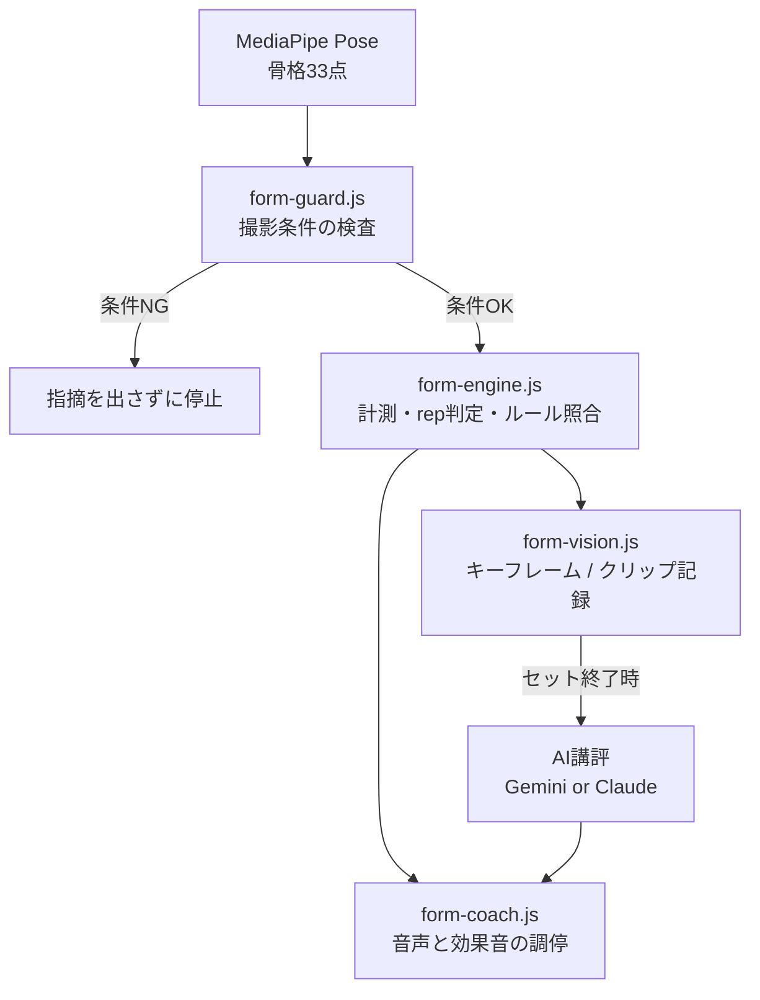

# フォームコーチ

カメラで筋トレの動作を見て、フォームが崩れたところだけを指摘するブラウザツール。
インストール不要、単一フォルダ、映像は端末の外に出ない。

---

## ⚠️ 先に読むこと

これは**補助ツールであって、指導者の代わりではない**。

- 単眼カメラなので、奥行き方向の動き（前後の重心移動、骨盤の回旋、脊柱の細かな屈曲）は正確に見えない。
- **警告が出ないことは、安全を意味しない。** 特にデッドリフトの背中の丸まりは、MediaPipe に胸腰椎の点が無いため代理指標による推定にとどまる。
- 痛みを感じたら中止すること。高重量では必ず補助者を付けること。
- 閾値の初期値はシミュレーション由来の暫定値。実際の動画で調整するまで精度は出ない（→ [閾値の調整](#閾値の調整)）。

---

## できること

- 骨格をリアルタイムに解析し、**崩れた瞬間だけ**を音声と効果音で指摘する
- レップを自動計数し、可動域とテンポ（下ろし／挙上）を記録する
- セット終了後、崩れたレップの映像を AI に見せて講評を得る（任意）
- 撮影条件（見切れ・距離・向き・別人への乗り移り）を検知して、条件が悪いときは**フォームの指摘を止める**

### 対応種目

| 種目 | アングル | 画角 | 主に見るもの |
|---|---|---|---|
| スクワット | 正面 / 側面 | 全身 | 膝の内側崩れ、深さ、前傾、踵浮き、左右差 |
| デッドリフト | 側面 | 全身 | 尻先行、バーの離れ、ロックアウト |
| 腕立て伏せ | 側面 | 全身 | 腰の落ち／尻上がり、可動域 |
| ブルガリアンスクワット | 正面 / 側面 | 全身 | 前脚の膝の内側崩れ、骨盤の傾き、深さ、上体の流れ |
| ブルガリアンスクワット | 正面 / 側面 | 全身 | 前脚の膝の内側崩れ、骨盤の落ち込み、横流れ、深さ |
| ダンベルカール | 正面 / 側面 | 上半身 | 肘の前後移動、反動、左右差、下ろしの速さ |
| ダンベルショルダープレス | 正面 / 側面 | 上半身 | 腰の反り、押し切り、左右差 |
| ダンベルサイドレイズ | 正面 | 上半身 | 上げすぎ、反動、肘の曲がり、左右の高さ |

**ブルガリアンスクワットは接地している前脚を自動で判定する。** 後ろ足を台に乗せると足首の高さに差が出るので、それを手がかりに作用脚を選ぶ。後ろ足を床に置く通常のスプリットスクワットでは差が小さく、判定できないことがある。

**画角が「上半身」の種目では足元を映さなくてよい。** 撮影条件の検査もそれに合わせて切り替わり、代わりに腕が画面から出ていないかを見る。

---

## 動作要件

| 項目 | 要件 |
|---|---|
| ブラウザ | Chrome / Edge / Safari（カメラと WebAssembly が使えること） |
| 配信 | **HTTPS 必須**。`file://` ではカメラが使えない |
| 通信 | 初回に MediaPipe（CDN）を取得。以降はキャッシュされる |
| AI講評 | 任意。自分の API キーを入力する（BYOK） |

---

## 設置

### GitHub Pages（推奨）

カメラは HTTPS でないと動かないので、ローカルでファイルを直接開くより Pages のほうが確実。スマホからも開ける。

1. リポジトリを作り、**6ファイルすべて**を同じ階層に置く
2. Settings → Pages → Source を `main` / `root` に設定
3. `https://<ユーザー名>.github.io/<リポジトリ名>/` を開く

相対パスで参照しているので、サブパス配下でもそのまま動く。

> **APIキーを絶対にコミットしないこと。**
> 無料プランの Pages は公開リポジトリが前提で、静的ファイルは誰でも読める。
> キーは利用者が設定画面から入力し、`localStorage` にのみ保存される設計になっている。
> テスト中に一時的にハードコードして push すると即座に流出する。

### ローカルで動かす場合

```bash
python3 -m http.server 8000
# → http://localhost:8000/ を開く（localhost はセキュアコンテキスト扱い）
```

---

## 使い方

1. 種目とカメラ位置（正面／真横）を選ぶ
2. 「カメラを開始」→ 全身が入る位置に立つ
3. 撮影条件に問題があればバナーが出る。指示に従って直す
4. 直立したまま待つと基準を取得する（正面視のみ、約1.2秒）
5. 「始めろ」と言われたら開始
6. 動作を止めて8秒経つとセットが締まり、講評画面に移る

**画面の見かた**

- 左上の大きな数字：レップ数
- 右端の縦ゲージ：沈み込み。青線＝レップ成立ライン、白線＝目標深度
- 下部のカード：直近の指摘（黄＝警告、赤＝危険）
- 骨格の色：緑＝正常、黄＝条件に難あり、赤＝追跡ロスト

音声は**危険 → 警告 → レップ数**の優先度で調停され、古い指摘は破棄される。1レップあたりの指摘は最大2件。

---

## AI講評の設定

設定画面で「使わない / Gemini / Claude」を選び、自分の API キーを入力する。

| | Gemini | Claude |
|---|---|---|
| 送るもの | **動画クリップ**（レップ単位） | 静止画4枚 |
| 見えるもの | 切り返しの速さ、バーの軌跡、崩れが始まる瞬間 | 姿勢の断面のみ |
| 無料枠 | あり（Flash系） | なし |
| プライバシー | **無料枠では入力がモデル改善に使われうる** | 学習に使われない |

動作解析では動画のほうが情報量で勝る。ただし自分の身体の映像を送ることになるので、無料枠のデータ利用が気になる場合は課金を有効にするか、Claude を選ぶこと。

講評は軽量モデル（Flash / Haiku 系）で十分なことが多い。モデル一覧では軽量なものが上に並ぶようにしてある。

### 接続テスト

**キーを入れたら必ず「接続テスト」を押すこと。**
ブラウザから API を直接叩けるかを確認し、成功すると**そのキーで使えるモデルの一覧**を取得してプルダウンに出す。

| 表示 | 意味 | 対処 |
|---|---|---|
| 接続できました | そのまま使える | モデルを選んで保存 |
| 通信はできました。モデル名が古いので… | 通信は成功。モデルが存在しない（404） | 出てきた一覧から選び直す |
| ブラウザから直接呼べませんでした | CORS 遮断か通信エラー | このプロバイダは Pages では使えない |
| キーが正しくない可能性があります | 400 | キーを見直す |
| レート制限中です | 429 | キーは有効。時間をおく |

> **モデル名は固定していない。**
> Gemini も Claude もモデルの入れ替わりが速く、名前を決め打ちすると数ヶ月で 404 になる。
> そのため接続テスト時に API へ問い合わせて、実際に使えるものだけを選択肢に出している。
> 404 が出たら「キーが悪い」ではなく「モデル名が古い」と考えて、一覧から選び直せばよい。

動画が取れない環境（MediaRecorder 非対応など）では、Gemini 選択時でも自動的に静止画へ退避する。

---

## アーキテクチャ

5層に分かれている。**上の層が通らなければ下の層は動かない**のが設計の核心。



### 各層の役割

| ファイル | 役割 | 設計上の要点 |
|---|---|---|
| `form-guard.js` | 撮影条件の検査 | 条件の問題をフォームの問題として指摘しないための門番。足元が切れているのに「浅い」と言うのは有害。判定はヒステリシス付き |
| `form-engine.js` | 計測・rep判定・ルール照合 | ルールは宣言的な JSON。`eval` を使わない。測れない指標はアングルに応じて自動で無効化 |
| `form-coach.js` | 音声・効果音の調停 | 本体は「何を喋るか」ではなく**何を喋らないか**。TTSは200〜400ms遅れるので、即時性は効果音で担保する |
| `form-vision.js` | 深掘り層 | セット中は呼ばない。呼ぶのは休憩に入った瞬間だけ |
| `index.html` | 本番アプリ | 4層を配線し、HUD を描画する |
| `tuner.html` | 調整ベンチ（開発用） | 実動画に対して閾値を詰める |

### 即時層と深掘り層を分ける理由

即時層（ルールベース）は数ミリ秒で判定でき、危険動作にその場で反応できる。
深掘り層（AI）は数値に現れない崩れを言語化できるが、レイテンシとコストがかかる。

そこで**即時層でリアルタイム性を、深掘り層で質を**担保する。AI 講評が失敗してもルール層の指摘は既に届いているので、体験は劣化しない。

さらに深掘り層には `disagreeWithRules` という経路があり、AI が「数値上は警告だが映像ではそう見えない」と返せる。ルールベースの誤検知を潰す仕組み。

---

## 種目を追加する

`form-engine.js` の `EXERCISES` にブロックを1つ足すだけ。

```js
overheadPress: {
  id: 'overheadPress',
  label: 'オーバーヘッドプレス',
  recommendedView: 'side',
  supportedViews: ['side'],
  viewHint: { side: '真横から胸の高さで撮影。' },

  // 計測する量の宣言（式や関数は書かない。型と参照点だけ）
  metrics: [
    { id: 'elbowAngle', type: 'angle', points: ['shoulder','elbow','wrist'], side: 'auto' },
    { id: 'trunkLean',  type: 'leanFromVertical', from: 'hip', to: 'shoulder', side: 'mid' },
  ],

  // rep計数
  rep: { metric: 'elbowAngle', top: 165, bottom: 80,
         direction: 'increasing', minRepMs: 800, minProgress: 0.35 },

  // 毎フレーム判定するルール
  checkpoints: [{
    id: 'layback', metric: 'trunkLean',
    phases: ['ascending'], view: 'side',
    warn: { op: '>', value: 20 }, danger: { op: '>', value: 32 },
    strikes: 4, cooldownMs: 4000,
    message: { warn: '反りすぎだ。腹を締めろ。', danger: '腰が危険だ。重量を落とせ。' },
  }],

  // 1レップ終わらないと判断できないもの
  repChecks: [{
    id: 'rom', field: 'romPercent',
    warn: { op: '<', value: 85 },
    message: { warn: '押し切れていない。肘を伸ばせ。' },
  }],
}
```

### 片脚種目の扱い

ブルガリアンスクワットのような片脚種目では `side: 'workingLeg'` を使う。後ろ足を台に乗せるため、**接地している前脚のほうが足首が画面上で低い**。これで作用脚を自動判定し、左右どちらを前にしても同じルールが当たる（差が小さいときは直前の判定を維持してチラつきを防ぐ）。

左右差を見る `lrDifference` は使えない。前後で脚の角度が構造的に違うため、常に大きな差が出てしまう。代わりに `tiltFromHorizontal` で骨盤が水平を保てているか（トレンデレンブルグ徴候）を見る。

### 使える metric の型

| type | 意味 | 主な用途 |
|---|---|---|
| `angle` | 3点がなす角度 | 関節角度 |
| `lrDifference` | 左右の角度差 | 左右差 |
| `segmentRatio` | 2点間距離 ÷ 基準長 | 沈み込み（正面視） |
| `leanFromVertical` | 鉛直からの傾き | 体幹角 |
| `medialDeviation` | 直線からの内側偏位 | 膝の内側崩れ（正面視のみ） |
| `lineDeviation` | 直線からの垂直方向のズレ | 腰の落ち |
| `verticalGap` | 2点の高さの差 | 踵浮き |
| `horizontalDrift` | 開始位置からの水平ドリフト | バーパス |
| `riseRatio` | 時間窓での上昇速度比 | 尻先行（デッドリフト） |
| `tiltFromHorizontal` | 左右を結ぶ線の水平からの傾き | 骨盤の落ち込み（正面視のみ） |
| `tiltFromHorizontal` | 左右2点を結ぶ線の水平からの傾き | 骨盤の落ち込み（正面視のみ） |

`side` には `left` / `right` / `mid` / `auto`（見えている側）/ `workingLeg`（接地している脚）が指定できる。

`view` に `front` / `side` を指定すると、そのアングル以外では自動的に無効化される。誤ったアングルで嘘の警告が出ない。

`side` には `left` / `right` / `auto`（可視性の高い側）に加えて `workingLeg` が使える。片脚種目で、接地している側の脚を自動で選ぶ。

### 種目ごとの向きに関する2つの指定

スクワットは「休止位置が上」だが、カールやプレスは「休止位置が下」で、先に挙げて後で下ろす。そのままだとテンポの記録と局面の呼び名が逆になるため、次の2つを指定する。

```js
rep: { ..., eccentricFirst: false },   // 先に挙げる種目。下ろし／挙上の記録を入れ替える
phaseLabels: { top:'構え', descending:'挙上', bottom:'収縮', ascending:'下ろし' },
framing: 'upperBody',                  // 足元を映さない種目。足の見切れを問題にしない
```

### 基準相対で測るべきもの

絶対値で閾値を引くと、体格・靴・カメラの角度で人ごとに外れる指標がある。その場合は `baseline: true` を付けて、静止時からの変化量で見る。

```js
{ id:'heelLift', type:'verticalGap', a:'heel', b:'foot', normalizeBy:'torso', baseline:true },
{ id:'pelvicTilt', type:'tiltFromHorizontal', point:'hip', baseline:true },
```

基準値は最初の25フレームの**中央値**で決める（1フレーム目だけを使うと、その瞬間の推定誤差がそのまま基準になる）。`angle` `verticalGap` `tiltFromHorizontal` `horizontalDrift` が対応している。

判断の目安：

| 絶対値でよい | 基準相対にすべき |
|---|---|
| 体幹の傾き（鉛直が基準として意味を持つ） | 踵とつま先の高さの差（足の形と見下ろし角で変わる） |
| 膝角度・肘角度（関節角そのものに意味がある） | 骨盤の傾き（カメラの傾きがそのまま乗る） |
| 膝の内側偏位（自分の股関節-足首線が基準） | 上腕の振れ（構えの姿勢に個人差がある） |

### 判定の3段階

| パラメータ | 決めるもの |
|---|---|
| `warn` / `danger` の値 | 閾値を超えた**フレーム数** |
| `strikes` | 何フレーム連続で超えたら発火するか（単発ノイズを弾く） |
| `cooldownMs` | 次に同じ指摘をするまでの間隔 |

この3つを混同すると「閾値をいじっても効かない」状態になる。調整ベンチでは `16f → 2回`（逸脱16フレーム、発火2回）のように分けて表示している。

---

## 閾値の調整

`tuner.html` を開く（開発用ツール。利用者向けにリンクは張らないほうがよい）。

1. 自分の動画を選ぶ（端末内で処理される）
2. 種目とアングルを合わせて「骨格を抽出」
3. **グラフ上の閾値の線を直接ドラッグ**する。下段の発火マークが即座に増減する
4. 波形をクリックするとその瞬間の映像に飛ぶ。「なぜここで鳴ったか」を骨格付きで確認できる
5. 「調整結果を書き出す」→ `form-engine.js` の該当ブロックを置き換える

### キャッシュが3段になっている

| 段 | 内容 | 再計算のきっかけ | コスト（17秒の動画） |
|---|---|---|---|
| 1 | 骨格 | 動画を変えたとき | 抽出時のみ |
| 2 | 計測値 | 平滑化・可視性・アングル・種目 | 43ms |
| 3 | 判定 | 閾値・連続数・クールダウン・rep上下端 | **0.29ms** |

閾値レールを掴んでいる間は段3しか走らないので、ドラッグが引っかからない。

### 調整のコツ

- 「中央 / 上位5% / 最大」の統計が上部に出る。正常な動作の上位5%より少し上に警告を置くと当たりがよい
- 平滑化（EMA）のラグで可動域は実測より5〜8%低く出る。深さの閾値はその分を見込む
- まずは軽い重量で、明らかに正しいフォームと明らかに崩したフォームの両方を撮ると境界が決めやすい

---

## 既知の限界

- **脊柱の丸まりは直接測れない。** MediaPipe に胸腰椎の点が無い。デッドリフトでは股関節角と体幹角を代理指標にしているが、過信は禁物
- **斜め45度は正面でも側面でもない。** どちらのルールも精度が落ちるため、検知して警告するだけで解析は続行する
- **複数人が映ると乗り移る。** MediaPipe Pose は1人しか追わない。腰の瞬間移動と体格の急変で検知し、状態をリセットする
- **重量・種目の自動判別はしない。** 手動で選ぶ
- **バーパスは手首の水平ドリフトによる代理指標。** バー自体は検出していない
- **膝がつま先より前に出ることは指摘しない。** 良し悪しが定まっておらず、片方に断定すると根拠のない指導になるため
- **ダンベルロウ系は入れていない。** 主な失敗（背中の丸まり、体幹の回旋）がどちらも 2D では測れず、「警告が出ない＝正しい」という誤解を生むため
- **膝が爪先より前に出ることは指摘しない。** 現在の指導では必ずしも失敗とされず、ブルガリアンスクワットではむしろ自然に起きるため、ルール化していない
- **反動で速すぎるレップは計数しない。** 黙って捨てると理由が伝わらないので、「速すぎる。反動だ」と伝える（`minRepMs` で調整可能）

---

## ファイル構成

```
├── index.html         本番アプリ
├── tuner.html         閾値の調整ベンチ（開発用）
├── form-engine.js     計測・rep判定・ルール照合
├── form-coach.js      音声と効果音の調停
├── form-guard.js      撮影条件の検査
└── form-vision.js     キーフレーム／クリップ記録 + AI講評
```

依存はすべて CDN（MediaPipe Pose、Google Fonts）。ビルド工程なし。

---

## プライバシー

- 撮影映像は端末内で処理され、サーバーには送られない
- AI講評を有効にした場合のみ、**崩れたレップの映像**（動画2本または静止画4枚）が選んだプロバイダの API に送られる
- API キーは `localStorage` にのみ保存される
- Gemini の無料枠では、送信した内容が Google のモデル改善に使われる場合がある

---

## ライセンス

（未設定。公開するなら MIT などを置くこと）
